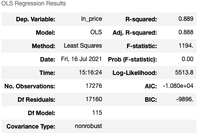
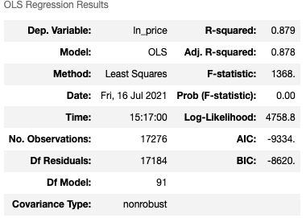
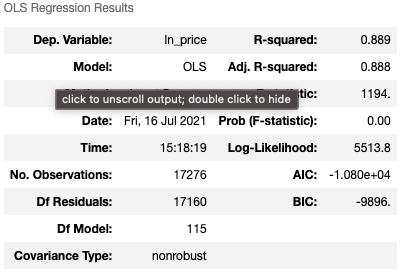
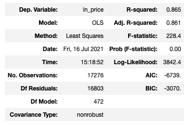

# A Regression Model That Appraises Homes Remotely for ACME Bank

**Authors**: Nate Walter, Douglas Lu, Shane Mangold. Arthur Kim

## Table of Contents
* [Overview](#Overview)
* [Business Problem](#Business-Problem)
* [The Data](#The-Data)
* [Methods](#Methods)
* [Results](#Results)
* [Conclusions](#Conclusion)
* [Next Steps](#Next-Steps)
* [Repository Structure](#Repository-Structure)

## Overview
This project utilizes the King County House Sales dataset, which is an existing dataset based on data from house sales of King County, WA from 2014 to 2015. Through the Data Science Process, we seek to understand our dataset through Exploratory Data Analysis and prepare and model our data through an iterative approach. We begin from the baseline model and utilize an assortment of statistical techniques: linear regression, multlinear regression, ordinary least squares, recursive feature elimination, and binomial feature engineering.

Through the various statistical methods, we then seek to iterate across different models to idenitfy the model with the most optimal statistical R-Squared Value, RMSE, and differential values. Then, we look to highlight the two main features that best provide predictions to housing prices. 

With price prediction in mind, our purpose for our statistical analysis is to provide banks to appraise home values throughout the COVID-19 pandemic. Without the need to physically enter the domicile of clients' homes, banks would be able to provide appraisal services to prospective clients and existing clients in hopes of capturing more market share in the residential real estate market. 


Our findings will help ACME bank develop and validate home appraisals without the need for outside individuals to enter the a client or prospect's home. ACME can then use the predictions to set sales prices for homes to be put on the market at 
competitive market values based on the regression model's predictions.


## Business Problem

With the recent wave of Delta variants in the Covid-19 string, key executives at ACME Bank have came to Group One Inc. to seek solutions on providing its clients and prospects with alternative ways to obtain home appraisal values. ACME Bank is seeking to gain more marketshare from their competitors by providing appraisal services throughout the pandemic, with the hopes of helping its clients and prospects feel safe and comfortable while offering them a solution to appraise their homes. 

Executives at ACME Bank have come to Group One Inc. in hopes of identifying a model that would help best predict home prices given a home's typical features. For example, given a dataset containing 20,000 different homes and its home features (i.e. number of bedrooms, number of bathrooms, square foot of living space, year built, zip code, etc), ACME Bank would like to know whether it can appropriately appraise a home's value with these different data. Accordingly, executives at ACME Bank have provided us with a dataset for house sales in King County from 2014 - 2015 in hopes obtaining a solution that could model a home's price. At Group One Inc., we have formulated a statistical model to answer this business problem.  


## Data
The Dataset used is from King County, Washington between May 2014 and May 2015. It includes housing sales prices along with other descriptive information invovling the properties. 

* https://www.kaggle.com/harlfoxem/housesalesprediction

The Data that was included in our model can be seen below, broken down into target, numeric, and categorical data. 

**Target Data**: 

Price - Prediction Target

**Numeric Data**: 
bedrooms - Number of Bedrooms
bathrooms - Number of Bathrooms
sq_ft living - Square footage of living space
sqft_lot - Square footage of the lot
sqft_above - Square footage of the house 
sqft_basement - Square footage of the basement 
lat - latitude coordinate
long - longitude coordinate
sqft_living15 - The square footage of interior living space of surrounding 15 neighbors 
sqft_lot15 - The square footage of the land lots of the nearest 15 neighbors

**Categorical Data**: 
floors - total floors in the house
waterfront - view of waterfront of house
view - number of times the house has been viewed
condition - how good the condition of the house is 
grade - overall grade of housing unit condition,based on King County grading system
if_renovated - whether house was renovated
zipcode - location of the house
month_of_date - month of when the house was sold 


## Methods
This project uses multiple linear regression in combination with feature engineering, recursive feature elimination, 
and dummy regression to predict an unknown house's sales price, all while adhering to the assumptions of linear regression. 
Test are performed to discover any linear relationship between the dependent and independent variables. Multicollinearity is 
examined between the independent variables. The normal distribution of errors and homeoscedasticity are also omni-present goals to be met.  
Our model uses train-test split which allows us to evaluate whether it has the right balance of bias and variance. 
We use data visualization via Matplotlib and Seaborn, taking advantage of histograms, heatmaaps and scatter plots to 
help in the exploritory data analysis process as well as evaluation and presentation. The three questions explored are:

**1)** What features must be dropped to make an accurate predictive model?

**2)** How accurate is our model to the true price of a King County home?

**3)** Can our predictions substitute for in person appraisal?

Before we began our investigation, we performed exploratory data anlysis and converted any null values into integers. For any null values, we assumed a value of 0. We then converted the dates to month and year in the dataset and also converted year built and year of date of the data into a new category called "age of house". We dropped any duplicate values as well as irrelveant columns such as ID and date. Then, we converted categorical data from floats to integers and dummied out categorical values. 

To further investigate these questions in our dataset, we first used log transformation in the pre-processing to correct for any right-skewed data into normal distibution and standardized the x-values after creating the train-test split for our dataset. After adjusting our data during the pre-processing stage, we then created a simple baseline model for benchmarking purposes. As a seperate benchmark, we also looked to score our models for goodness of fit by investigating the R-Squared values as well as each model's root mean squared error (RMSE) values. Each model that was created also underwent a k-fold cross validation to check for any internal data integrity as well as assumption tests for homoscedasticity and normality. 

We applied the above methodology across the 4 models that we created and narrowed down to our best model based on the model's R-Squared and RMSE value. 


## Results

The scope of this dataset all pertains to homes in King County, thus the training and testing data on our model would be highly multicollinear beetween the training and testing data's variables. 

Our first model, Model 1, depicted strong results. Model 1 was created with a multiple linear regression on every variable that came from the dataset, in which all features of a home were compared against the price of the home. Price in Model 1 was also log transformed into standard price values. This resulted in a R-Squared value of 0.889, differential of 0.00697, and RMSE of 122,558.91:



Our second model, Model 2, is a model that looked at feature specific p-values to be filtered out, specifically those with alpha values above the 0.05 threshold. While Model 2 eliminated several features, the test score R-Squared (0.869), differential value (0.00991) and RMSE value (140,511.22) was not as strong as Model 1. The fit on the data has dropped by removing features containing p-values greater than 0.05. In light of this decrease in accuracy we will continue to rely on our "best" Model 1:



Our third model, Model 3, leverages recursive feature elimination to eliminate uncessary variables in the model in hopes of achieving a better predicting model. The model's respective R-Squared value, differential, and RMSE is: 0.882, 0.00688, 122,840.97. Looking at the score results it becomes apparent that the trade off for removing features from our original model is a reduced R-squared statistic. However, Model 3's R-Squared and RMSE value were also not as strong as that of Model 1. Thus, Model 1 still has a higher R-Squared score and a lower RMSE than that of Model 3, therefore, Model 1 is still the best model. 



Our last model, Model 4, utilized polynomial feature engineering to create new features that would hopefully depict better precision on the regression and produced an R-Square value of 0.866, a differential of 0.23054, and a RMSE of 77,213,973,151 Unfortunately, the polynomial model was extremly sensitive to outlier values versus that of more simpler models: 




## Conclusions

The final conclusion of the business recommendation hinges on our best-performing Model 1: a multiple linear regression model. More specifically, this multi-linear regression model leverages the power of log to transform all positive variables. Simultaneously, this model also dummies out categorical variables to derive its statistical results. The multiple linear regression model proves to be the most robut model in dealing with outlier values while also proving to be the most accurate model when benchmarked against its R-Squared values as well as its RMSE values. 


Hence, given a set of housing datapoints, our multiple linear regression model can aid in predicting the housing prices from a given dataset. While one may assume that complex models may provide a more accurate prediction, our results reveal that a more simple model actually provides more accurate solutions, thus satisfying the principle of Occam's razor. Furthermore, the simple multiple linear regression model also reveals that amongst all features, location features and square footage of living space seems to have the biggest impact on housing prices. Thus, for the sake of predicting home values, it is essential to capture accurate data pertaining to these two features of any home.  


## Next Steps

The model can be further improved with additional datasets within the same county (King County), or from different counties nearby in the Seattle-metro region. Furthermore, datasets from King County from earlier years (pre-2014) could also help improve the model. 

The model could also be further tuned with consideration of the housing inflation from 2015-2021 as prices may have increased from the impact of the ongoing COVID-19 pandemic. 

Outliers within the dataset can also contribute to discrepencies within the model. Further investigation into outliers within the dataset could also help further improve the model. 

The model is currently tuned for a dataset that encapsulates both small-medium houses as well as larger houses. A seperation and distinction between the two styles of homes could also help improve the model.


## Repository Structure

```
├── bakeoff_data
│   ├── Xtest.csv
│   ├── Xtrain.csv
│   └── ytrain.csv
├── data
│   ├── column_names.md
│   ├── kc_house_data.csv
│   └── view
├── DS_060721_Group_1_bakeoff_results.csv
├── README.md
├── bakeoff.ipynb
├── king_county_appraisal_analysis_presentation.pdf
├── king_county_appraisal_model_vF.ipynb
└── king_county_heatmap.ipynb

```

This notebook uses a non-standard DSI library, named geopandas, as well as one named shapely
conda install -c conda-forge geopandas
conda install shapely
import geopandas as gpd
from shapely.geometry import Point, Polygon
